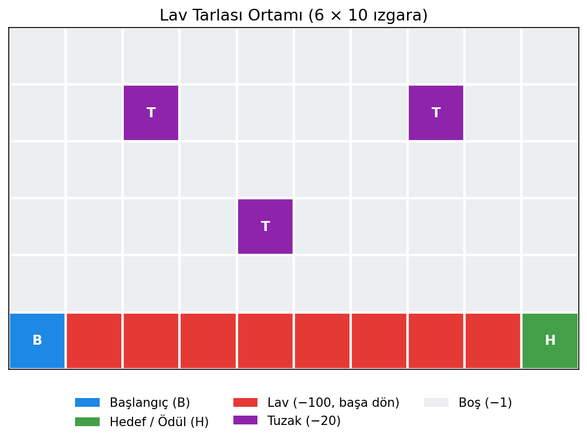
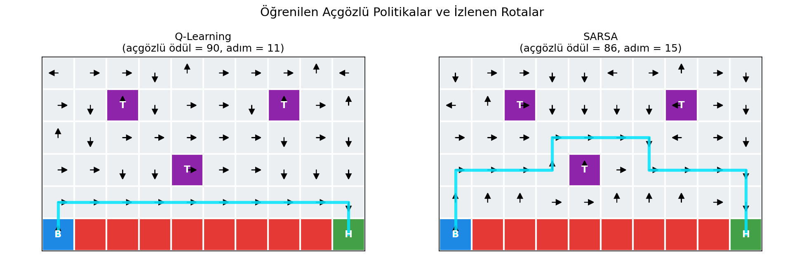
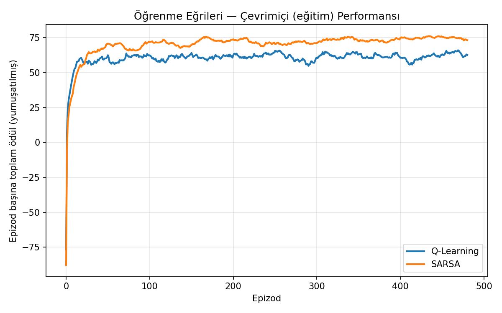
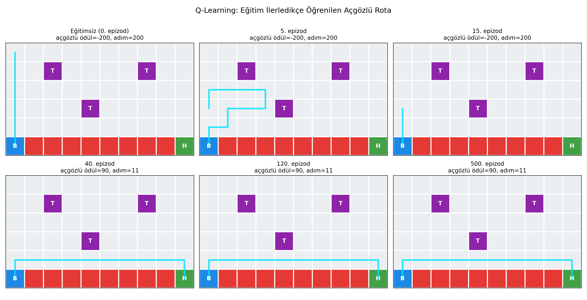
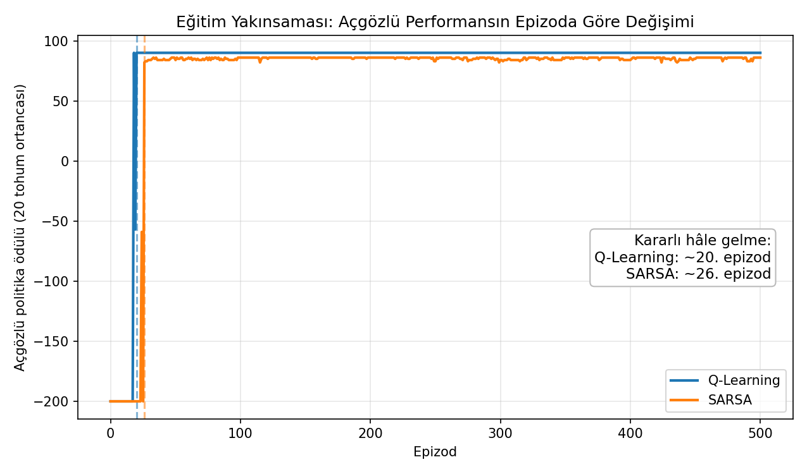
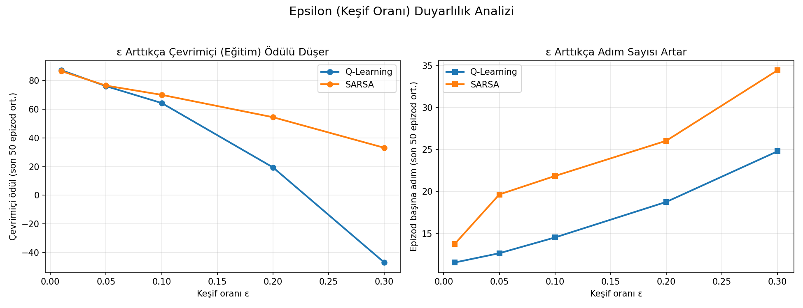

# Lav Tarlasında Güvenli Rota Öğrenimi: Q-Learning vs SARSA

Bursa Teknik Üniversitesi **Pekiştirmeli Öğrenmeye Giriş** dersi dönem projesi.

Bu projede, lav şeridiyle bölünmüş özel bir **ızgara dünyası (GridWorld)** ortamı tasarladım ve bir ajanı **Q-Learning** ve **SARSA** tablolu pekiştirmeli öğrenme yöntemleriyle eğittim. Ortam, **riskli ama kısa** (lavın kenarından) ile **güvenli ama uzun** yol arasındaki tercihi açığa çıkaracak şekilde tasarlandı; böylece **on-policy (SARSA)** ile **off-policy (Q-Learning)** öğrenme arasındaki fark somut olarak gözlemlenebiliyor.

## Ortam



Ortam bir Markov Karar Süreci (MKS) olarak modellendi: **(S, A, P, R, γ)**

- **Durum (S):** ızgaradaki konum — 60 durum
- **Eylem (A):** Yukarı, Aşağı, Sol, Sağ
- **Ödül (R):** adım −1, tuzak −20, lav −100 (+ başlangıca dönüş), hedef +100
- **İndirim faktörü (γ):** 0.95

## Yöntemler

| Yöntem | Tür | Güncelleme hedefi |
|---|---|---|
| **Q-Learning** | off-policy | r + γ · max Q(s′, a′) |
| **SARSA** | on-policy | r + γ · Q(s′, a′) |

Karşılaştırma için ayrıca **rastgele politika** (alt referans) ve **BFS** ile bulunan en kısa güvenli yol (model-tabanlı üst referans) kullanıldı.

## Sonuçlar

Q-Learning açgözlü politikada **optimal kısa yolu** (lavın kenarı), SARSA ise **güvenli uzun yolu** öğreniyor:



| Yöntem | Açgözlü ödül | Adım | Çevrimiçi (son 50 epizod) |
|---|---:|---:|---:|
| Q-Learning | 90 | 11 | 64.0 |
| SARSA | 86 | 15 | 74.2 |
| Rastgele politika | ≈ −3734 | — | — |

Çevrimiçi (eğitim) ödülde SARSA, Q-Learning'i geçiyor (lav kenarından kaçınıp daha az ceza aldığı için); Q-Learning ise açgözlü değerlendirmede en kısa yolu buluyor. Bu, on-policy/off-policy farkının somut bir gösterimidir.



## Eğitim Aşaması

Ajan eğitimsizken hedefe ulaşamaz (ödül −200); kısa sürede öğrenip kararlı hâle gelir — **Q-Learning ~20. epizod**, **SARSA ~26. epizod**. Aşağıda Q-Learning'in öğrendiği rotanın eğitim boyunca gelişimi ve açgözlü performansın yakınsaması görülmektedir.





## Keşif Oranının (ε) Etkisi

ε büyüdükçe ajan daha sık rastgele hareket eder ve lavaya daha çok düşer → **çevrimiçi ödül düşer, epizod başına adım sayısı artar**; ancak öğrenilen açgözlü politika optimal kalır. Ayrıca SARSA, yüksek ε'de Q-Learning'den daha az bozulur (daha güvenli).



## Çalıştırma

```bash
cd kod
pip install -r requirements.txt
python main.py        # Windows'ta: py main.py
```

Program eğitimi yapar, sayısal özeti ekrana yazar (`sonuclar.txt`) ve tüm grafikleri `figurler/` klasörüne üretir.

Ek analizler için: `python egitim_asamasi.py` (eğitim aşaması ve yakınsama) ve `python epsilon_analizi.py` (ε duyarlılığı).

## Proje Yapısı

| Klasör / Dosya | Açıklama |
|---|---|
| `kod/environment.py` | `LavaGridWorld` — ortam (MDP) |
| `kod/agents.py` | `TDAgent` — Q-Learning / SARSA |
| `kod/baselines.py` | Rastgele politika ve BFS en kısa yol |
| `kod/experiments.py` | Eğitim döngüsü ve deneyler |
| `kod/visualize.py` | Grafik üretimi |
| `kod/main.py` | Ana çalıştırma dosyası |
| `kod/egitim_asamasi.py` | Eğitim aşaması ve yakınsama analizi |
| `kod/epsilon_analizi.py` | Keşif oranı (ε) duyarlılık analizi |
| `figurler/` | Üretilen grafikler |
| `sonuclar.txt` | Örnek çalıştırma çıktısı |

---

*Hazırlayan: Kubilay İnanç · Öğretim Üyesi: Dr. İlhan Tunç · Bursa Teknik Üniversitesi*
